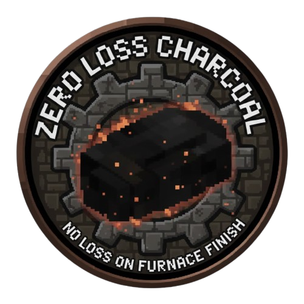

<p align="center">
  
</p>

<h1 align="center">Zero Loss Charcoal</h1>

<p align="center"><i>No more wasted charcoal. 100% yield — every burn, every time.</i></p>

<p align="center">
  <a href="https://mods.vintagestory.at/zerolosscharcoal"></a>
  
  
  
</p>

## 🌑 Overview

**Zero Loss Charcoal guarantees that no charcoal is ever lost when a pit finishes burning.**
After conversion, the mod scans the entire structure and upgrades every `charcoalpile-*` to full height — ensuring
perfect yield with **zero randomness**.

This is a **complete rewrite** inspired by *NoCharcoalLost* (BillyGalbreath).
No source code reused — only the idea preserved and modernized.

## 🔥 Features

| Feature                         | Description                                                  |
|---------------------------------|--------------------------------------------------------------|
| 🏴 100% charcoal retention      | Never lose output again — every pit becomes max yield        |
| ⚙ Automatic structure detection | Works on any size, shape, height, industrial pits included   |
| 🌐 Server-side only             | Clients don’t need to install — drop-in friendly             |
| 📊 Configurable                 | Max pile height can be adjusted easily                       |
| 🧱 Zero collateral              | Only affects logically connected piles — never breaks builds |

## ⚙ How It Works

Vintage Story normally converts wood into charcoal using final stack height, often producing **partial yield**.

Zero Loss Charcoal overrides that behavior by:

1. Detecting connected charcoal blocks using **flood-fill**
2. Converting them all to full `charcoalpile-N` height
3. Ensuring **exact maximum yield every time**

Example result:

```txt
charcoalpile-1 ➜ charcoalpile-8  
charcoalpile-4 ➜ charcoalpile-8  
charcoalpile-6 ➜ charcoalpile-8
```

## 🛠 Configuration

`ZeroLossCharcoalConfig.json`

```json
{
  "MaxPileHeight": 8
}
```

| Field           | Default | Notes                                             |
|-----------------|:-------:|---------------------------------------------------|
| `MaxPileHeight` |    8    | Higher values work but require modded pile blocks |

## 📥 Installation

1. Download the newest `.zip` release
   **[https://mods.vintagestory.at/zerolosscharcoal](https://mods.vintagestory.at/zerolosscharcoal)**
2. Drop it into your mod folder:

   ```
   Windows → %AppData%/VintagestoryData/Mods  
   Linux   → ~/.config/VintagestoryData/Mods
   ```

3. Restart server — done.

No client installation is required.

## 🖤 Credits

| Contribution                   | Author                            |
|--------------------------------|-----------------------------------|
| Original concept               | BillyGalbreath (*NoCharcoalLost*) |
| Complete rewrite & maintenance | **HarukaYamamoto0**               |

Original repository reference:
[https://github.com/BillyGalbreath/VS-NoCharcoalLost](https://github.com/BillyGalbreath/VS-NoCharcoalLost)

## 📜 License

All implementations here are newly written.
The underlying idea belongs to the original author.

MIT licensed. Free to use, fork, learn from and expand.
